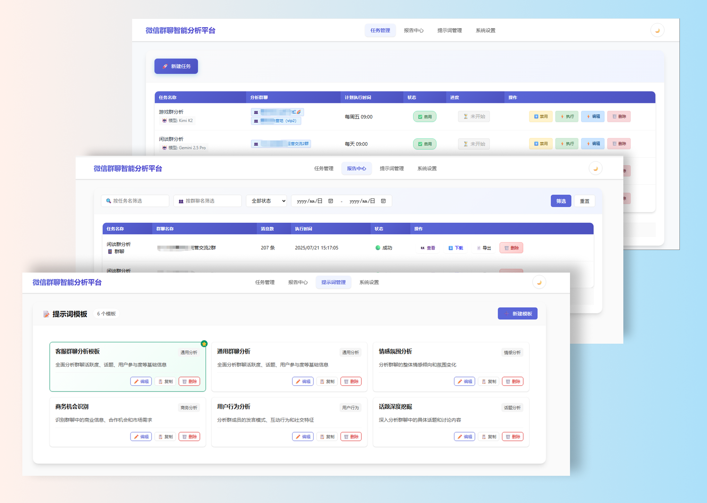

# 微信群聊智能分析平台 V2.1

## 项目概述

这是一个基于Node.js的本地Web应用，用于自动分析微信群聊记录并生成智能分析报告。该平台专为非技术用户设计，提供简单易用的界面和自动化的分析流程，支持多群聊独立分析、定时任务调度和智能报告生成。


## 项目截图


主界面展示了任务列表、分析进度和报告预览功能。


## 核心特性

### 🚀 **智能分析引擎**
- **多LLM模型支持**：集成DeepSeek、Gemini、Kimi等主流大语言模型
- **提示词模板系统**：6个预设分析模板，支持自定义提示词
- **群聊分别分析**：每个群聊独立分析，生成专属报告
- **智能内容解析**：自动识别聊天记录格式，支持多种数据源

### 📊 **任务管理系统**
- **灵活定时配置**：支持单次执行、每日定时、每周定时
- **实时进度监控**：任务执行状态实时更新，支持进度追踪
- **批量群聊处理**：一次任务可分析多个群聊，并行处理
- **任务状态管理**：启用/禁用、立即执行、状态重置等完整操作

### 📋 **报告中心**
- **多条件筛选**：按群聊名称、执行时间、消息数量等筛选报告
- **在线预览**：直接在浏览器中查看分析报告
- **聊天记录导出**：TXT格式导出原始聊天记录

### 🔧 **系统管理**
- **首次运行向导**：自动引导完成初始配置
- **配置管理**：API密钥、服务地址等集中管理
- **实时日志监控**：彩色日志输出，支持实时刷新
- **数据备份**：JSON文件存储，易于备份和迁移

## 系统要求

- **Node.js版本**：16.0+ (推荐18.0+)
- **操作系统**：Windows 10+, macOS 10.15+, Ubuntu 18.04+
- **内存要求**：最小2GB，推荐4GB+
- **磁盘空间**：最小1GB，推荐5GB+（含数据存储）
- **网络要求**：稳定互联网连接，支持HTTPS
- **外部服务**：ChatLog服务（默认端口5030）或兼容的聊天记录数据源


## 快速开始

  建议先看新手使用教程.md，它是最全面教程。


### 1. 启动服务

**Windows用户：**
```bash
# 双击文件夹中的 "启动服务-终极实时版.bat" 文件
```

**macOS/Linux用户：**
```bash
# 双击文件夹中的 "启动服务-终极实时版.sh" 文件
# 或在终端中运行：
chmod +x 启动服务-终极实时版.sh
./启动服务-终极实时版.sh
```

### 2. 访问应用

服务启动后，浏览器会自动打开配置页面，或手动访问：
```
http://127.0.0.1:8080
```

### 3. 完成配置

首次运行时，系统会引导您完成以下配置：

1. **ChatLog服务地址**：通常为 `http://127.0.0.1:5030`
2. **LLM API密钥**：
   - DeepSeek API Key
   - Gemini API Key  
   - Kimi API Key

### 4. 开始使用

配置完成后，您可以：

1. 创建分析任务
2. 选择要分析的群聊
3. 设置执行时间
4. 自定义分析提示词
5. 等待自动执行并查看报告

## 项目结构

```
wechat-analysis-platform/
├── app.js                          # 应用入口文件
├── package.json                    # 项目配置和依赖
├── 启动服务-终极实时版.bat          # Windows启动脚本
├── 启动服务-终极实时版.sh           # macOS/Linux启动脚本
├── 任务追踪-微信群聊智能分析平台V2.0.md  # 项目开发追踪文档
├── config/                         # 配置文件
│   └── models.js                   # LLM模型配置
├── routes/                         # 路由层
│   ├── index.js                    # 页面路由
│   └── api.js                      # API接口路由
├── services/                       # 业务逻辑层
│   ├── chatlogService.js           # 聊天记录服务
│   ├── llmService.js               # LLM分析服务
│   ├── scheduler.js                # 定时任务调度器
│   └── settingsManager.js          # 配置管理服务
├── utils/                          # 工具函数
│   ├── database.js                 # 数据库操作工具
│   ├── logger.js                   # 日志系统
│   └── startup.js                  # 启动检查工具
├── views/                          # EJS模板文件
│   ├── index.ejs                   # 首页
│   ├── tasks.ejs                   # 任务管理页面
│   ├── task-form.ejs               # 任务创建/编辑页面
│   ├── reports.ejs                 # 报告中心页面
│   ├── prompt-templates.ejs        # 提示词模板管理
│   └── settings.ejs                # 系统设置页面
├── public/                         # 静态资源
│   ├── css/                        # 样式文件
│   │   ├── style.css               # 全局样式
│   │   ├── task-form.css           # 任务表单样式
│   │   └── task-list.css           # 任务列表样式
│   └── js/                         # 前端JavaScript
│       ├── task-form.js            # 任务表单逻辑
│       ├── task-list.js            # 任务列表逻辑
│       ├── reports.js              # 报告中心逻辑
│       └── ui-manager.js           # UI管理工具
├── data/                           # 数据存储目录
│   ├── config.json                 # 系统配置数据
│   ├── tasks.json                  # 任务数据
│   ├── reports.json                # 报告数据
│   └── prompt_templates.json       # 提示词模板数据
├── reports/                        # 生成的分析报告
├── logs/                           # 应用日志文件
└── test_*.js                       # 测试和调试工具
```

## 开发状态

**当前版本：V2.1**  
**开发阶段：功能完整，持续优化**  

### ✅ 已完成功能（V2.1）
- [x] **核心架构**：完整的MVC架构，模块化设计
- [x] **数据存储**：JSON文件数据库，支持CRUD操作
- [x] **任务管理**：创建、编辑、删除、启用/禁用任务
- [x] **定时调度**：单次/每日/每周定时执行，实时进度监控
- [x] **多LLM集成**：DeepSeek、Gemini、Kimi完整支持
- [x] **提示词系统**：6个预设模板，支持自定义提示词
- [x] **报告中心**：多条件筛选、在线预览、批量导出
- [x] **ChatLog集成**：外部服务集成，多格式数据解析
- [x] **聊天记录导出**：TXT格式导出，支持批量ZIP打包
- [x] **UI优化**：响应式设计，现代化界面，图标对齐修复
- [x] **群聊搜索**：实时搜索过滤，智能匹配
- [x] **首次运行向导**：自动配置检测，引导式设置
- [x] **实时日志系统**：彩色输出，跨平台兼容
- [x] **启动脚本**：Windows/macOS/Linux全平台支持

### 🔄 持续优化功能
- [ ] **前端框架升级**：考虑引入Vue.js/React提升交互体验
- [ ] **数据库迁移**：计划迁移至SQLite提升查询性能
- [ ] **容器化部署**：Docker支持，简化部署流程
- [ ] **多用户权限**：团队协作功能，权限管理系统
- [ ] **API文档**：完整的API文档和开发者指南
- [ ] **自动化测试**：单元测试和集成测试覆盖

### 🎯 未来规划（V3.0）
- [ ] **智能分析引擎**：AI驱动的分析策略优化
- [ ] **可视化仪表板**：数据图表，趋势分析
- [ ] **微服务架构**：支持大规模部署和扩展
- [ ] **云原生支持**：弹性扩容，负载均衡

## 技术栈

### 后端技术
- **运行环境**：Node.js 16.0+
- **Web框架**：Express.js 4.18+
- **模板引擎**：EJS 3.1+
- **定时任务**：node-cron 3.0+
- **HTTP客户端**：Axios 1.6+
- **文件处理**：fs-extra, archiver
- **日期处理**：moment.js

### 前端技术
- **核心技术**：原生JavaScript (ES6+)
- **样式框架**：CSS3 + Flexbox/Grid
- **UI组件**：自定义组件库
- **图标系统**：Emoji + 自定义图标
- **响应式设计**：移动端优先

### 数据存储
- **主数据库**：JSON文件存储（轻量级，易维护）
- **配置管理**：JSON配置文件
- **日志存储**：按日期分割的日志文件
- **报告存储**：HTML文件 + 元数据索引

### 外部集成
- **LLM服务**：DeepSeek API, Gemini API, Kimi API
- **数据源**：ChatLog服务，支持多种聊天记录格式
- **代理支持**：HTTP/HTTPS代理（Clash等）

### 开发工具
- **包管理**：npm
- **开发服务器**：nodemon
- **代码规范**：ESLint（计划中）
- **测试框架**：自定义测试工具
- **文档工具**：Markdown + 项目追踪文档

## 性能特点

- **启动速度**：< 10秒完整启动
- **内存占用**：< 200MB运行时内存
- **并发处理**：支持5个任务同时执行
- **分析速度**：1000条消息/分钟处理能力
- **文件大小**：基础安装 < 50MB
- **响应时间**：API响应 < 500ms

## 安全特性

- **本地部署**：数据完全本地存储，无云端传输
- **API密钥管理**：加密存储，环境变量支持
- **访问控制**：本地网络访问限制
- **数据隐私**：支持敏感数据脱敏
- **备份策略**：多级数据备份机制

## 贡献指南

本项目正在积极开发中，欢迎提交问题和建议。

## 许可证

MIT License

## 联系信息

如需帮助或有任何问题，请查看项目文档或提交Issue。 